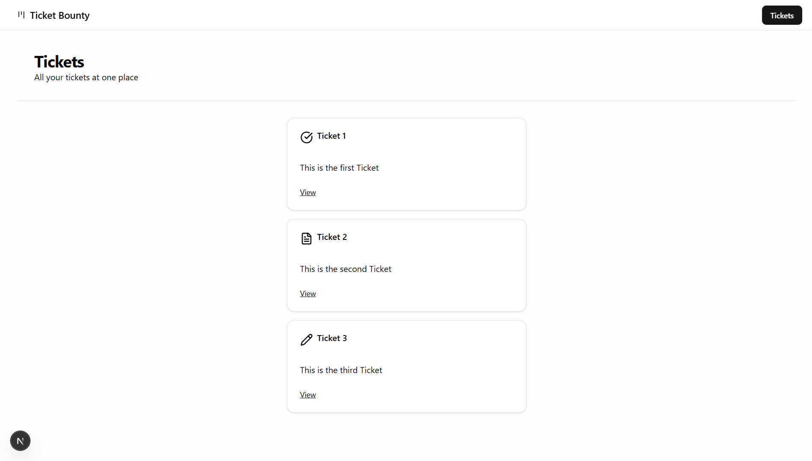

# Ticket Bounty

A modern ticket management system built with Next.js 16, React 19, and Shadcn UI.

**Live Demo**: [View on Vercel](https://ticket-bounty-seven.vercel.app/)



## Features (In Progress)

- **Ticket Management**: View and manage tickets with different statuses (Open, In Progress, Done)
- **Dynamic Routing**: Individual ticket detail pages with dynamic routes
- **Modern UI**: Built with Shadcn UI components and Tailwind CSS
- **Type-Safe**: Full TypeScript support
- **Modern Styling**: Built with Tailwind CSS and dark mode support

## Tech Stack

- **Framework**: Next.js 16 (App Router)
- **Language**: TypeScript
- **Styling**: Tailwind CSS v4
- **UI Components**: Shadcn UI (Card, Button, Separator, etc.)
- **Icons**: Lucide React

## Project Structure

```
ticket-bounty/
├── app/
│   ├── page.tsx              # Home page
│   ├── tickets/
│   │   ├── page.tsx          # Tickets list page
│   │   └── [ticketId]/
│   │       └── page.tsx      # Individual ticket detail page
│   ├── layout.tsx            # Root layout with navigation
│   └── globals.css           # Global styles and theme
├── components/
│   ├── ui/                   # Shadcn UI components
│   └── heading.tsx           # Reusable heading component
├── constants/
│   └── paths.ts              # Route path constants
└── data/
    └── data.ts               # Initial ticket data
```

## Getting Started

```bash
# Install dependencies
npm install

# Run development server
npm run dev

# Type check
npm run type

# Build for production
npm run build
```

Open [http://localhost:3000](http://localhost:3000) to view the app.

## Current Status

🚧 This project is currently in development.

### Implemented
- ✅ Basic routing structure
- ✅ Ticket listing with status icons
- ✅ Individual ticket pages
- ✅ Shadcn UI integration
- ✅ Reusable components (Heading, Card)
- ✅ Dark theme support
- ✅ Path constants for type-safe routing

### Coming Soon
- 🔄 Backend integration
- 🔄 CRUD operations
- 🔄 Authentication
- 🔄 Database integration
