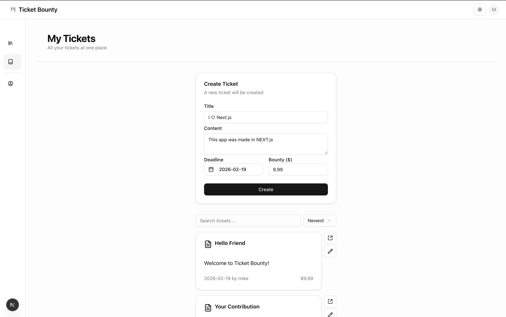

# Ticket Bounty

A ticket management system built with Next.js App Router, React Server Actions, Prisma, and Shadcn UI.

**Live Demo**: [View on Vercel](https://ticket-bounty-seven.vercel.app/)



---

## Overview

Ticket Bounty is a high-performance ticket management system designed to showcase modern Full-stack Next.js patterns:

- Server Actions for mutations
- App Router with layouts and route guards
- Session-based authentication
- Form state management with useActionState
- Zod validation and cache revalidation

It focuses on type-safe data fetching, robust server-side state management, and a seamless user experience using the latest React Server Components architecture.

- 🚧 The project is functional but still evolving.

---

## Features

### Authentication & Authorization
- **User Registration**: Sign up with username, email, and password
- **Session-Based Auth**: Secure HTTP-only cookies with 30-day TTL
- **Password Security**: Argon2 hashing for secure password storage
- **Protected Routes**: Layout-based route guards for authenticated sections
- **Ownership Checks**: Users can only edit/delete their own tickets

### Ticket Management
- **Ticket CRUD**: Create, view, edit, and delete tickets with confirmation dialogs
- **Status Workflow**: Update ticket status (Open → In Progress → Done) via dropdown menu
- **Deadline & Bounty**: Date picker for deadlines, currency input with cent-precision (big.js)
- **Scoped Views**: "All Tickets" (public) and "My Tickets" (user's own)
- **Search & Sort**: Debounced search by title, sort by newest/oldest/bounty via URL state (nuqs)
- **Pagination**: Configurable page size with next/previous navigation

### Comments
- **Comment System**: Add and delete comments on ticket detail pages
- **Ownership Controls**: Users can only delete their own comments
- **Deleted User Handling**: Comments persist when user is deleted (SetNull relation)

### Account Management
- **Account Dropdown**: Avatar menu with profile, password, and sign-out
- **Profile Page**: User profile settings with tab navigation
- **Password Page**: Password management with tab navigation

### Server-Side Architecture
- **Server Actions**: All mutations handled server-side
- **Server Components**: Direct database queries in async components
- **API Routes**: REST endpoints for tickets (`/api/tickets`)
- **Cache Revalidation**: Efficient path-based cache invalidation

### Form Handling
- **Zod Validation**: Schema-based validation with field-level error messages
- **ActionState Pattern**: Track form submission state across client/server
- **Loading States**: useFormStatus for automatic pending UI
- **Toast Notifications**: Sonner toasts including post-redirect feedback via cookies
- **Input Persistence**: Form values retained on validation failure
- **DatePicker Reset**: Imperative reset on successful submission

### User Interface
- **Sidebar Navigation**: Expandable sidebar with hover animations and active path detection
- **Account Dropdown**: Avatar with profile/password/sign-out menu
- **Breadcrumbs**: Navigation breadcrumbs on detail pages
- **Dark/Light Mode**: Theme toggle with next-themes
- **Modern UI**: Shadcn UI components + Tailwind CSS v4
- **Loading Skeletons**: Suspense boundaries with spinner fallbacks
- **Error Boundaries**: Custom error pages for exceptions
- **Confirmation Dialogs**: Alert dialogs for destructive actions

### Database & Type Safety
- **PostgreSQL**: Database via Prisma with native pg adapter
- **Prisma v7**: Type-safe ORM with auto-generated types
- **End-to-End TypeScript**: Full type coverage from database to UI

---

## Tech Stack

| Category | Technology |
|----------|------------|
| **Framework** | Next.js 16 (App Router) |
| **Language** | TypeScript 5 |
| **Database** | PostgreSQL (Supabase) |
| **ORM** | Prisma v7 with native pg adapter |
| **Authentication** | Custom session-based auth |
| **Password Hashing** | Argon2 |
| **Validation** | Zod v4 |
| **Styling** | Tailwind CSS v4 |
| **UI Components** | Shadcn UI (Radix UI primitives) |
| **Icons** | Lucide React |
| **Notifications** | Sonner |
| **Theme** | next-themes |
| **Date Handling** | date-fns + react-day-picker |
| **URL State** | nuqs |
| **Currency** | big.js |

---

## Project Structure

```
ticket-bounty/
├── app/
│   ├── page.tsx                    # Home page (All Tickets)
│   ├── layout.tsx                  # Root layout (NuqsAdapter, Header, Sidebar, ThemeProvider)
│   ├── template.tsx                # Route template with RedirectToast
│   ├── globals.css                 # Global styles and theme
│   ├── sign-in/page.tsx            # Sign-in page
│   ├── sign-up/page.tsx            # Sign-up page
│   ├── _navigation/                # Co-located navigation components
│   │   ├── header.tsx              # Top navigation bar
│   │   ├── sidebar.tsx             # Collapsible sidebar
│   │   └── account-dropdown.tsx    # User avatar menu
│   ├── api/
│   │   └── tickets/                # REST API endpoints
│   │       ├── route.ts            # GET all tickets
│   │       └── [ticketId]/route.ts # GET single ticket
│   └── (authenticated)/            # Protected route group
│       ├── layout.tsx              # Auth guard (getAuthOrRedirect)
│       ├── error.tsx               # Error boundary
│       ├── tickets/
│       │   ├── page.tsx            # My Tickets + create form
│       │   └── [ticketId]/
│       │       ├── page.tsx        # Ticket detail + comments
│       │       ├── edit/page.tsx   # Ticket edit (owner-only)
│       │       ├── loading.tsx     # Loading skeleton
│       │       └── not-found.tsx   # 404 page
│       └── account/
│           ├── profile/page.tsx    # User profile page
│           ├── password/page.tsx   # Password management page
│           └── _navigation/tabs.tsx # Profile/Password tab nav
├── actions/
│   └── cookies.ts                  # Cookie server actions (get, set, consume)
├── components/
│   ├── ui/                         # Shadcn UI components (14 components)
│   ├── form/                       # Form components (Form, SubmitButton, FieldError)
│   │   ├── hooks/                  # useActionFeedback hook
│   │   └── utils/                  # ActionState utilities
│   ├── sidebar/                    # Sidebar navigation
│   │   ├── components/             # SidebarItem
│   │   ├── constants.tsx           # Nav items configuration
│   │   └── types.ts                # NavItem type
│   ├── theme/                      # ThemeProvider, ThemeSwitcher
│   ├── breadcrumbs.tsx             # Breadcrumb navigation
│   ├── search-input.tsx            # Debounced search input
│   ├── sort-select.tsx             # Sort dropdown (composite key)
│   ├── pagination.tsx              # Pagination controls
│   ├── date-picker.tsx             # Calendar popover date picker
│   ├── confirm-dialog.tsx          # Confirmation dialog hook + UI
│   ├── redirect-toast.tsx          # Post-redirect toast via cookies
│   ├── heading.tsx                 # Section heading component
│   └── card-compact.tsx            # Reusable card wrapper
├── features/
│   ├── auth/
│   │   ├── actions/                # sign-in, sign-up, sign-out
│   │   ├── components/             # SignInForm, SignUpForm
│   │   ├── queries/                # getAuth, getAuthOrRedirect
│   │   ├── hooks/                  # useAuth client hook
│   │   └── utils/                  # isOwner utility
│   ├── ticket/
│   │   ├── actions/                # upsert, delete, status
│   │   ├── components/             # TicketList, TicketItem, TicketUpsertForm,
│   │   │                           # TicketSearchInput, TicketSortSelect, TicketPagination
│   │   ├── queries/                # getTicket, getTickets (with pagination)
│   │   ├── search-params.ts        # nuqs search/sort/pagination parsers
│   │   ├── constants.tsx           # Status icons and labels
│   │   └── types.ts                # TicketWithMetadata type
│   └── comment/
│       ├── actions/                # createComment, deleteComment
│       ├── components/             # Comments, CommentItem, CommentCreateForm,
│       │                           # CommentDeleteButton
│       ├── queries/                # getComments
│       └── types.ts                # CommentWithMetaData type
├── constants/
│   └── paths.ts                    # Route path constants
├── lib/
│   ├── auth/                       # Authentication utilities
│   │   ├── password.ts             # Argon2 hash/verify
│   │   ├── session.ts              # Session create/validate/delete
│   │   └── cookies.ts              # Session cookie management
│   ├── prisma.ts                   # Prisma client singleton
│   ├── big.ts                      # big.js configuration
│   └── utils.ts                    # Utility functions (cn)
├── utils/
│   ├── currency.ts                 # Currency conversion (toCent, fromCent)
│   ├── get-active-path.ts          # Levenshtein-based path matching
│   └── url.ts                      # Base URL helper
├── prisma/
│   ├── schema.prisma               # Database schema (User, Session, Ticket, Comment)
│   ├── seed.ts                     # Database seeding script
│   └── migrations/                 # Migration history
└── prisma.config.ts                # Prisma configuration
```

## Getting Started

### Prerequisites

- Node.js 18+ installed
- PostgreSQL database (or Supabase account)

### Installation

```bash
# Clone the repository
git clone https://github.com/yourusername/ticket-bounty.git
cd ticket-bounty

# Install dependencies
npm install

# Set up environment variables
# Create .env file with:
# DATABASE_URL="postgresql://..."

# Run Prisma migrations
npx prisma migrate dev

# Seed the database (optional)
npx prisma db seed

# Run development server
npm run dev
```

Open [http://localhost:3000](http://localhost:3000) to view the app.

### Available Scripts

```bash
npm run dev          # Start development server
npm run build        # Build for production
npm run start        # Start production server
npm run lint         # Run ESLint
npm run type         # Run TypeScript type checking
npm run db:push      # Push schema changes to database
npm run db:seed      # Seed the database
npx prisma studio    # Open Prisma Studio (database GUI)
```

---

## Database Schema

```prisma
model User {
  id           String    @id @default(cuid())
  username     String    @unique
  email        String    @unique
  passwordHash String
  sessions     Session[]
  tickets      Ticket[]
  comments     Comment[]
}

model Session {
  id        String   @id
  expiresAt DateTime
  userId    String
  user      User     @relation(onDelete: Cascade)
}

model Ticket {
  id        String       @id @default(cuid())
  createdAt DateTime     @default(now())
  updatedAt DateTime     @updatedAt
  title     String
  content   String       @db.VarChar(1024)
  status    TicketStatus @default(OPEN)
  deadline  String
  bounty    Int          // Stored in cents
  userId    String
  user      User         @relation(onDelete: Cascade)
  comments  Comment[]
}

model Comment {
  id        String   @id @default(cuid())
  createdAt DateTime @default(now())
  content   String   @db.VarChar(1024)
  ticketId  String
  ticket    Ticket   @relation(onDelete: Cascade)
  userId    String?
  user      User?    @relation(onDelete: SetNull)
}

enum TicketStatus {
  OPEN
  IN_PROGRESS
  DONE
}
```

---

## Architecture Highlights

### Authentication Flow
1. User signs up/in with credentials
2. Password hashed with Argon2
3. Session created in database (30-day TTL)
4. Session ID stored in HTTP-only cookie
5. `getAuth()` validates session on each request

### Authorization Pattern
- **UI Layer**: Hide edit/delete buttons for non-owners
- **Server Actions**: Check `isOwner()` before mutations
- **Layout Guards**: Protected routes redirect if unauthenticated

### ActionState Pattern
```typescript
type ActionState = {
  status?: "SUCCESS" | "ERROR"
  message: string
  payload?: FormData    // Preserve values on error
  fieldErrors: Record<string, string[]>
  timestamp: number
}
```

## Current Status

**Implemented**
- Full authentication system (sign-up, sign-in, sign-out)
- Session-based auth with HTTP-only cookies
- Ownership-based authorization
- Core ticket CRUD operations
- Comment system (create, delete with ownership checks)
- Server Actions + Zod validation
- Form UX with ActionState pattern
- Cache revalidation on mutations
- Ticket status workflow (Open → In Progress → Done)
- Deadline and bounty fields with currency handling
- URL-synced search, sort, and pagination (nuqs)
- REST API endpoints for tickets
- Toast notifications and post-redirect feedback
- Confirmation dialogs for destructive actions
- Sidebar navigation with All Tickets / My Tickets / Account
- Account dropdown with profile and password pages
- Breadcrumb navigation
- Dark/light theme toggle
- Error boundaries and loading skeletons

**Planned**
- User profile editing
- Password change form
- Password reset flow
- Ticket assignments
